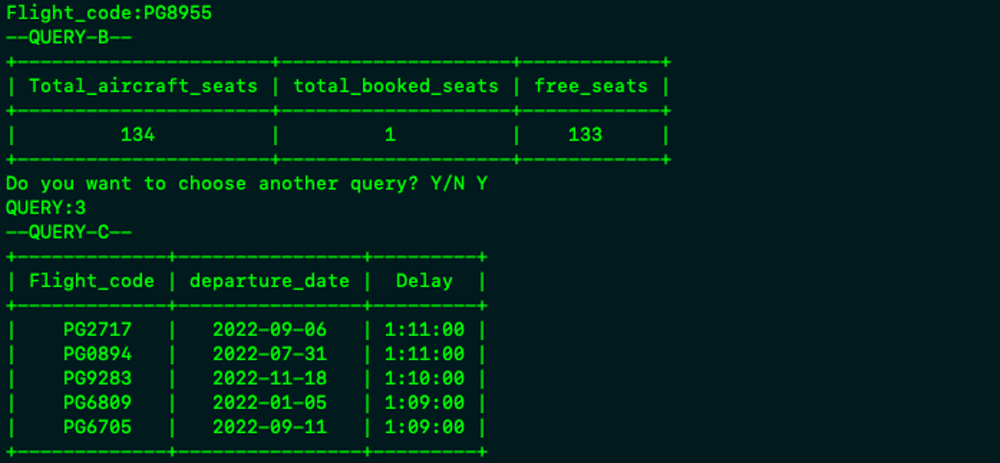

# Databases (2022) - Airline Company DB

## Project Overview
This project is a team assignment for the "Databases" course, offered in the 4th semester of the 2022 academic year at the University of Piraeus, Department of Informatics. The project focuses on designing, implementing, and querying a database for an airline company. The database includes entities such as bookings, tickets, flights, airports, aircrafts, and boarding passes. The tasks involve designing the relational schema, normalizing the database, creating views, executing complex queries, implementing triggers and cursors, and connecting the database with an application via API.

## Course Information

- **Institution:** University of Piraeus
- **Department:** Department of Informatics
- **Course:** Databases (2022)
- **Semester:** 4th

## Technologies Used

- Python
- PL/pgSQL

## Project Structure

- `airlineCreateTables.sql`: This file creates the database tables.
- `db_csv.zip`: This file contains all the data for the database.
- `airlineDBRestore.sql`: This file includes all the tables, their corresponding data, as well as the triggers and cursors for question 3.
- `Thema4.py`: This file contains the program for question 4.

## Usage Examples

The examples are from the thema4.py API

### 2a Query: Who traveled on a specific flight (e.g., PG0404) yesterday in seat 1A and when was the ticket reservation made? The "yesterday" date will be calculated based on the current date of the query execution.

```SQL
SELECT t.passenger_id, passenger_firstname, passenger_lastname, seat_no, bk.book_date AS ticket_book_date
FROM ((ticket AS t INNER JOIN passenger AS p ON t.passenger_id = p.passenger_id) INNER JOIN boarding_pass
AS b ON t.ticket_no = b.ticket_no) INNER JOIN flight AS f ON b.departure_date = f.departure_date INNER JOIN
booking AS bk ON f.departure_date = bk.departure_date WHERE f.flight_code = 'PG0878' AND seat_no = '52V'
AND f.departure_date= CURRENT_DATE - INTERVAL '1 DAY';
```


### 2b Query: How many seats remained available on the aforementioned flight?

```SQL
WITH ts AS (SELECT aircraft_capacity AS total_seats_no FROM flight AS f INNER JOIN aircraft AS air ON
f.aircraft_code = air.aircraft_code WHERE f.flight_code = 'PG6590' AND f.departure_date = CURRENT_DATE -
INTERVAL '1 DAY'), bs AS (SELECT COUNT(seat_no) AS booked_seats_no FROM ((flight AS fl INNER JOIN
boarding_pass AS bp ON fl.flight_code = bp.flight_code AND fl.departure_date = bp.departure_date) INNER JOIN
ticket AS t ON bp.ticket_no = t.ticket_no) INNER JOIN booking AS b ON b.book_ref = t.book_ref WHERE
fl.flight_code = 'PG6590' AND fl.departure_date = CURRENT_DATE - INTERVAL '1 DAY') SELECT
ts.total_seats_no AS total_aircraft_seats, bs.booked_seats_no AS total_booked_seats, (ts.total_seats_no -
bs.booked_seats_no) AS free_seats FROM ts, bs;
```


### 2c Query: Which flights had the greatest delays in 2022? Display the list of the top 5.

```SQL
SELECT flight_code, departure_date, actual_departure_time - scheduled_departure_time AS delay FROM flight
WHERE departure_date >= '2022-01-01' and departure_date <= '2022-12-31' AND flight_status = 'Arrived' ORDER
BY delay DESC LIMIT 5;
```


### 2d Query: Find the top 5 frequent travelers in 2022, i.e., those who traveled the most kilometers.

```SQL
SELECT pa.passenger_id AS passenger_id, pa.passenger_firstname AS firstname, pa.passenger_lastname AS
lastname FROM flight AS f INNER JOIN more_flights AS mf ON (f.flight_code = mf.flight_code AND
f.departure_date = mf.departure_date) INNER JOIN ticket AS ti ON mf.ticket_no = ti.ticket_no INNER JOIN
passenger AS pa ON pa.passenger_id = ti.passenger_id WHERE flight_status = 'Arrived' AND (f.departure_date >=
'2022-01-01' AND f.departure_date <= '2022-12-31') GROUP BY pa.passenger_id ORDER BY SUM(f.distance)
DESC LIMIT 5;
```


### 2e Query: Find the top 5 most popular destinations in 2022, i.e., the cities to which the most passengers traveled.

```SQL
SELECT city_name AS popular_destinations_in_2022 FROM flight AS f INNER JOIN airport AS a ON
f.arrival_airport = a.airport_code INNER JOIN city AS c ON a.airport_city_name = c.city_name WHERE
f.flight_status = 'Arrived' AND (f.departure_date >= '2022-01-01' AND f.departure_date <= '2022-12-31') GROUP
BY city_name ORDER BY COUNT(f.arrival_airport) DESC LIMIT 5;
```


### 2f Query: Find the "quickest" passengers, i.e., those who checked in first for all their flights. Consider only passengers who took at least two flights.

```SQL
WITH fp AS (SELECT pa.passenger_id AS passenger_id, pa.passenger_firstname AS firstname,
pa.passenger_lastname AS lastname, COUNT(fl.flight_code) AS times FROM passenger AS pa INNER JOIN ticket
as ti ON pa.passenger_id = ti.passenger_id INNER JOIN boarding_pass AS bp ON ti.ticket_no = bp.ticket_no INNER
JOIN flight AS fl ON bp.departure_date = fl.departure_date AND bp.flight_code = fl.flight_code INNER JOIN
more_flights AS mf ON fl.departure_date = mf.departure_date AND fl.flight_code = mf.flight_code WHERE
flight_status != 'Scheduled' GROUP BY pa.passenger_id)

SELECT passenger_id, firstname, lastname FROM fp WHERE times >= 2 ORDER BY times DESC LIMIT 5;
```


## Setup Instructions

To ensure the Python program runs correctly, you need to:
1. Install the following libraries:
   - Psycopg2
   - Sys
   - PrettyTable
2) In line 8 of the file, input the appropriate server details where you have loaded the database (which you can load directly after first creating a database named `airline` and using the Restore function in pgAdmin4 - you will find the `airlineDBRestore.sql` file that sets up the database for the exercise).

## Contributors

<table>
  <tr>
    <td align="center"><a href="https://github.com/thkox"><br /><sub><b>Theodoros Koxanoglou</b></sub></a><br /></td>
    <td align="center"><a href="https://github.com/ApostolisSiampanis"><br /><sub><b>Apostolis Siampanis</b></sub></a><br /></td>
    <td align="center"><a href="https://github.com/AimiliosKourpas"><br /><sub><b>Aimilianos Kourpas</b></sub></a><br /></td>
  </tr>
</table>

## License

This project is licensed under the MIT License - see the [LICENSE](./LICENSE) file for details.
